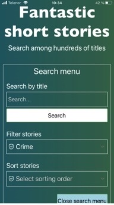
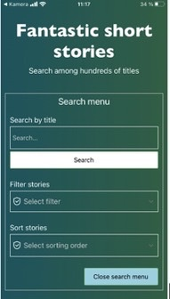
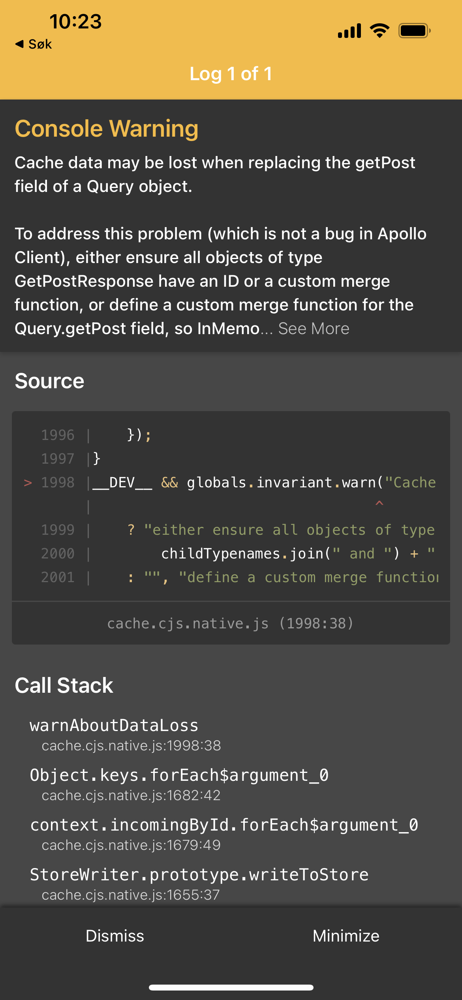
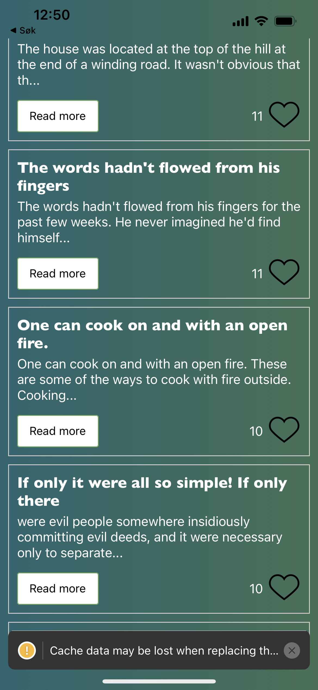
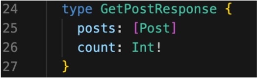

# **Project 4 - Fantastic short stories mobile application**

# Installing and running the application

Running the application locally:
To be able to run the application locally you will need to do the install below and then run as described.

### Install

- npm install

### Run

- npm start

Scann QR-code with your phone and open in Expo Go.
Alternatively the app can be opened in an android or iOS simulator by pressing a or i.

# Task a: React Native Client with expo-Cli

We chose task a, to make the frontend of the application from Project 3 in React Native. The backend used in this application is the same backend as in Project 3. For further information about this, read [README from project 3](https://gitlab.stud.idi.ntnu.no/it2810-h22/Team-27/project-3/-/blob/main/README.md)
. The React Native Client is connected to the backend on the Virtual Machine.

We chose this task since it gave us the opportunity to start learning about mobile application development, and we wanted to learn how apps created with React Native works.

# Functionality and content

## Search

The mobile application has a search menu with a search field with the possibility of searching for words contained in the title of the short stories. You can write the word you want to search for in the input field, and click the “Search” button. We have chosen to only show results when the whole word is a match.

## List-based presentation

Big result-sets are managed by a “Load more stories” button, pagination-functionality and a cache. This is connected to the offset-based pagination in the backend. For each time the user requests more short stories by pressing the “Load more stories” button, up to 10 new stories are fetched and the old ones are added to cache.

## Possibility to see more details

The user can see more information about each story by clicking the button “Read More”. When the button is clicked the user will be able to read the whole story and the different tags connected to the story. If the user wants to read less, it is possible to click the button “Read less”.

## Sort and filter

The stories can be filtered on the different tags available in the database. There are ten different tags, and each story can have a maximum of three tags. If the user after filtering on a specific tag wants to see stories on all tags they can select the option “Show all”. Furthermore, the stories can be sorted based on ascending (least to most) or descending (most to least) amount of likes.

## User-generated data

A user can add a like to each story, by clicking on the heart. This will increase the count of likes on the story, and the user will be able to see that the count goes up. It is also possible to remove a like, which will make the count go down.

This functionality is not optimal as the user can react more than once on a post if the page is closed and opened up again. Possible ways to fix this could be using localstorage to keep track of the stories reacted on, or make a user component.

# Technologies

## React Native

The application was initialized with “npx create-react-native-app -t with-typescript” after installing expo client “npm install -g expo-client”. The React Native framework was convenient since we could create one codebase with TypeScript that is compatible with both iOS and Android mobile applications. The way React Native is implemented also made it a lot easier to convert a web application to a mobile application. There are a lot of similarities between the two, for example props and states and hooks, and therefore we could reuse some of the code from the Reactjs application.

## Expo-Cli

Expo Client enabled us to make an universal app that can run on the web, iOS and Android. The application is only tested on iOS since that was the only resource the group had available. Due to React Native being platform independent we can assume that the app works correctly across platforms. Nevertheless it is worth mentioning that SafeAreaView is implemented. SafeAreaView is only applicable to iOS devices with version 11 or later and can therefore cause inconsistency between different platforms.

## Apollo Client

The Apollo Client is mostly used to manage the data by GraphQL, as in project 3. In this project we have also included the use of cache which reduces the number of fetches from the database. The cache is updated with updateQuery to contain both the previous results and the new, and this merged list is returned as the results of the fetchMore query.

## State management - Recoil

We have used Recoil, a state management library for React, to handle global state management. We experienced that this was a useful tool in project 3 and therefore chose to use it now as well. Recoil is used to share the states of chosen filter, sorting order and the searched text between files. Since we changed the way the application handles big datasets the use of recoil for the “Read more” state in project 3 was no longer needed and therefore removed in project 4.

## GraphQL

To gather data from the database we send a query or a mutation on the GraphQL format from the frontend to the backend. The query and mutations are placed in Queries.ts.

# About our GitLab-repo

Issues on gitlab have been used to keep track of the development tasks during the project. We added the labels “TODO”, “DOING” and “DONE” to keep track of the status of the different tasks, and thereby track the progression of the project.

# Sustainability

As mentioned above, for each time the user clicks on the “Load more stories” button, up to 10 new stories are fetched and the old ones are added to cache. This use of pagination and caching reduce the data traffic and the use of resources. Being able to use the data placed in the cache also makes the app faster because it does not need to make api calls for data that have already been fetched.

The api call to fetch the stories the user has searched for only happens when the user presses the Search button. Using a search functionality that does not continuously fetch data based on the input field is resource sustainable, since the app does not fetch unnecessary data.

The use of recoil for state management centralizes the state of the application, which makes the communication between components easier, and thus the team’s workflow more effective. We have also created more autonomous components in this project compared to project 3, which makes it easier to structure the project when implementing new features in the future.

# Accessibility

We have designed the app with the intention of making it user friendly for people with different disabilities. To ensure this we have used the four principles for accessibility for web content; **perceivable**, **understandable**, **robust** and **operable**.

The app also has a clear color contrast between the background and the text, which makes it more **perceivable** and easier to understand the content.

Above the various user interface elements there is a label that describes what the user is supposed to do. The application also gives feedback on actions. Touching the buttons changes the opacity which gives the user a hint of interaction. Furthermore, it gives feedback when there are no more stories to load, or no stories matching the search. This makes the app more **understandable** to use.

To ensure that the application is **robust** it should be tested on different devices. Since the group doesn’t have access to other devices than iOS, we can not be completely certain that it works as expected on other devices.

To take into account those with poor vision or who have difficulty pressing small buttons, we have made the touch surfaces of the user interface large. This is done to increase the **operability** of the page. Furthermore, all elements are accessible through touch, and the page is navigable through scrolling, both up and down. The placement of all elements are carefully considered to make the application as intuitive as possible.

The picture below on the right shows how the screen looks when the user increases the text size in the setting of their iPhone. The picture below on the left shows the screen when the iPhone’s default settings are used. This shows how the application can ensure operability for people with poor vision.

|  Increased text size in settings   |           Default settings            |
| :--------------------------------: | :-----------------------------------: |
|  |  |

# Testing

We have completed an E2E-test manually to check that important functionality works as anticipated. The search, filter and sorting fields have been tested separately and in combination. No errors have been found, and they seem to work as expected. Paging also works, where the “Load more stories” button loads 10 more stories, or gives feedback saying there are no more stories. The heart-button also works, where the reaction increases and decreases in the database when clicked, and shows the correct reaction-number on the page.

# Known errors

Fixing the errors described below would be of high priority in the hypothetical next sprint.

A user can like a story several times. If a user likes a story, then makes a search and goes back to the story recently liked, the story will not show as liked. It is worth mentioning that the database is correctly changed, i.e. the count of likes increases each time the heart is pressed, but the likes are not connected to specific users and are therefore not saved in the app.

If a user makes a search, closes the search menu, and then presses show search menu again, the search word recently written in the input field is not present.

"Warning: Cache data may be lost when replacing the getPost field of a Query object."
This warning probably occurs because we lack an id in our response from the backend. Since the backend was not supposed to be changed for our chosen task, the error has not been fixed. Due to this warning, other errors may occur. However, it is important to specify that the warning does not seem to affect the use of the application.
A possible fix would have been to add an id-field in GetPostResponse (shown in image at the bottom) in typeDefs.js in backend , with unique id’s for example by having automatic increasing numbers.

|              Warning               |       Warning shown in ExpoGo        |
| :--------------------------------: | :----------------------------------: |
|  |  |

